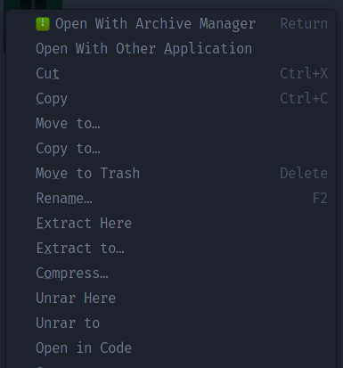

# nautilus-python scripts for additional submenus

This repo contains python scripts that add useful submenus to nautilus right
click menu.

All PRs are welcome.

### Installation

`curl -L https://raw.githubusercontent.com/haoadoreorange/nautilus-python-submenus/main/install.sh | sh`

### Why nautilus-python but not nautilus scripts...etc. ?

Read here
https://askubuntu.com/questions/21953/how-do-i-customize-the-context-menu-in-nautilus/889974#889974

### Open in VSCode submenu discussion

https://github.com/microsoft/vscode-docs/issues/873

  

